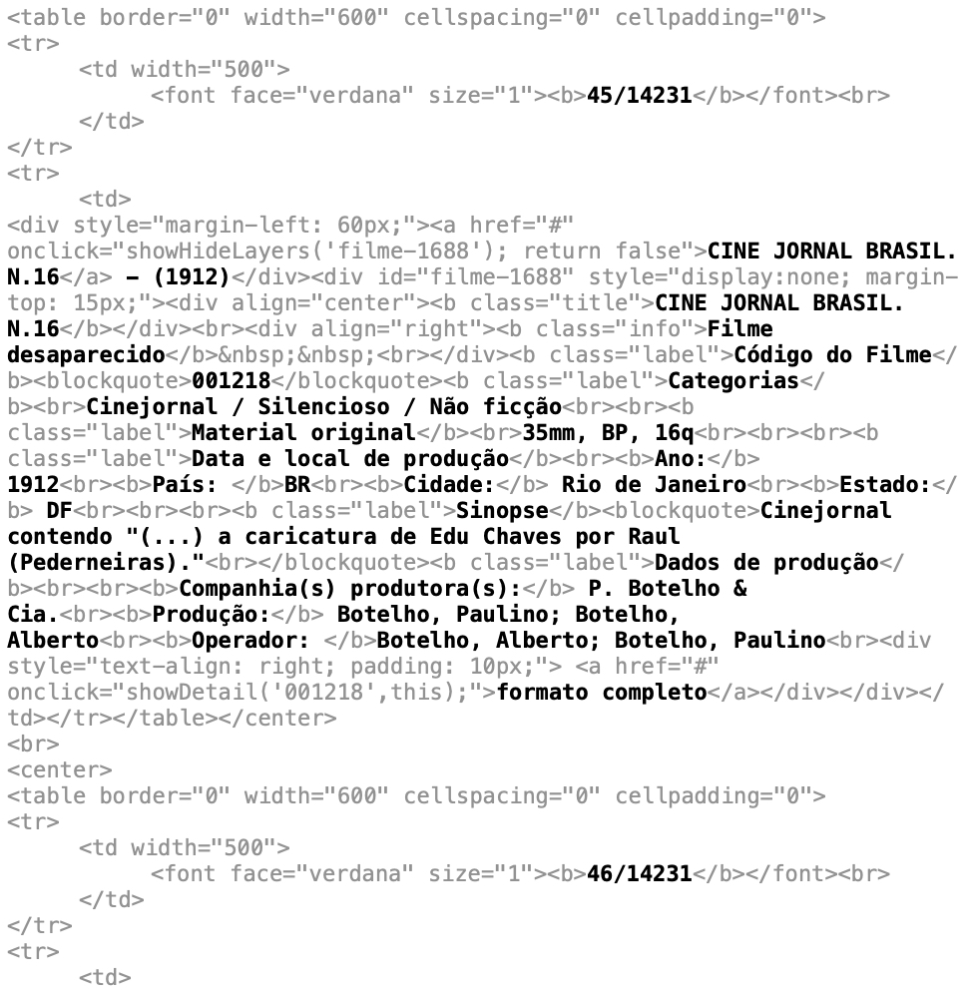
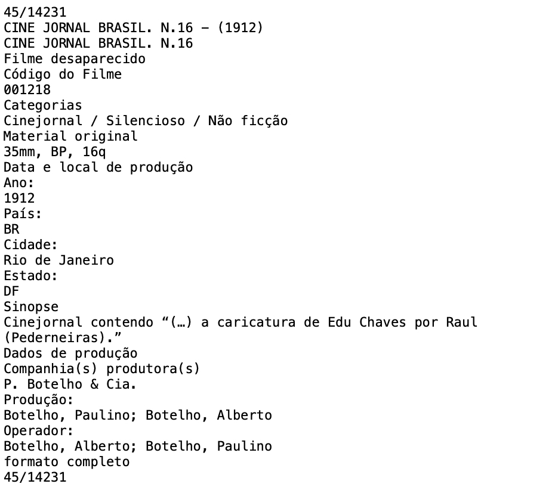
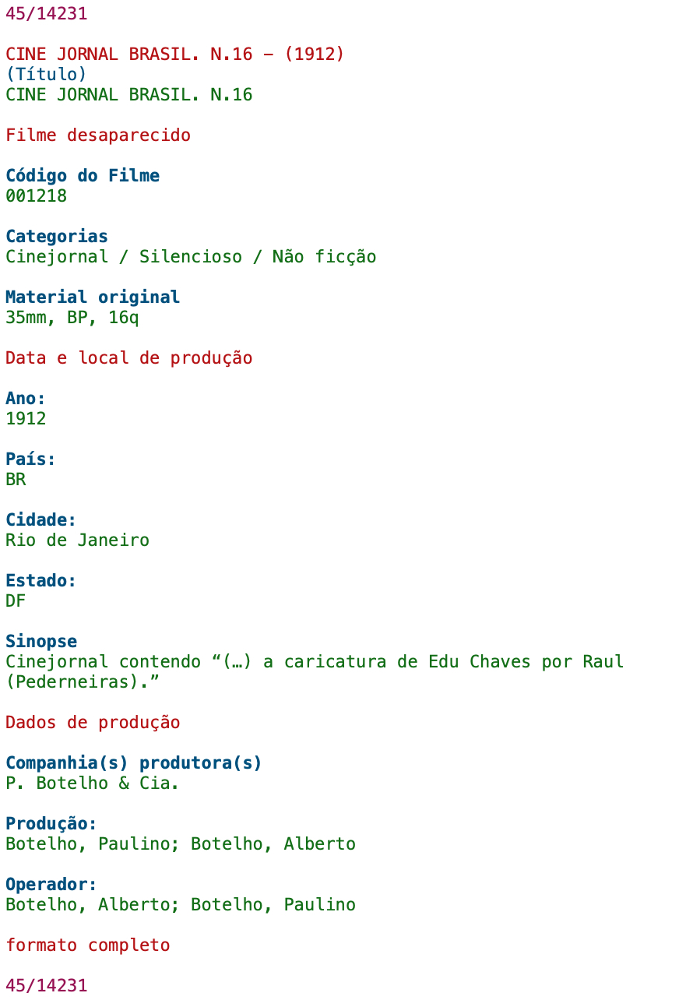

# Sofia 📽️

*Sofia* is a command line tool for parsing raw data imported from the [cinemateca](https://www.cinemateca.org.br/) website into a `.tsv` file.

It was created to help with the process of importing data from the cinemateca website into a spreadsheet, as the website only provides an option to export the data as a HTML file with no extension.

---

## 🛠️ Installation

### Automated (MacOS)

To install *Sofia* on macOS, run the following command:

```sh
curl -sSL https://raw.githubusercontent.com/felipepimentab/sofia/main/scripts/install.sh | sh
```

This will install [HomeBrew](https://brew.sh), [Git](https://git-scm.com), and [Node.js](https://nodejs.org) if missing, then globally link the `sofia` command.

After running it, close and reopen the terminal to update the *path*.

### Manual

First, make sure you have the following pre-requisites:

- [Node.js](https://nodejs.org)
- [Git](https://git-scm.com)

To install *Sofia* manually, simply clone this repository, install its dependencies with NPM, and add `sofia` to the terminal path.

## 🚀 Usage

### Command

```sh
Usage: sofia [options] <input-file> [output-file.tsv]

Arguments:
  input-file          Path to the raw file downloaded from cinemateca
  output-file.tsv     (optional) Destination TSV file (default: ./output.tsv)

Options:
  -h, --help          Display this help message
  -d, --debug         Dump intermediate processing to ./temp/debug.txt
```

### Converting files

To use *Sofia* you must first download the raw text file from the cinemateca website. The file has no extension and should be saved that way, because giving it an extension could cause issues with the text encoding. When dowloading, make sure you select the option to download as HTML.

Save it in a path close to the home path, with no spaces or accents.

Make sure *Sofia* has been installed, then run the `sofia` command as instructed.

For example, supposed the file was saved in the **Downloads** ⬇️ folder with the name `iah`, and you want the output to be saved as `output.tsv` in the **Documents** 📄 folder. Then, run:

```sh
sofia ~/Downloads/iah ~/Documents/output.tsv
```

## 🔩 How it works

*Sofia* uses Node.js to read a raw text file as downloaded from the cinemateca website, adjust its text encoding, parse it, extract relevant information and create a `.tsv` file containing a list of films.

### Encoding

The input text file is first read as a file with the **Latin-1** encoding, then decoded to **ISO-8859-1**, then encoded to **UTF-8**. This two-step convertion makes sure that no information is lost.

Below is a snippet of what the data should look like at this point. Some relevant information is highlighted for better visualization.



### Parsing and Transformation

The raw text (now properly encoded with **UTF-8**) is imported as a file, then converted to a string, which is the input for the parsing and transformation process.

The process includes several transformations, such as removing HTML tags and empty lines.



### Separating and Processing Each Film

The text is split into individual film records using a regex pattern that matches number patterns (e.g., "45/14231")

Each film record is processed to create a **Film** object. First an array is created by spliting the text on line breaks. Predefined headers are used to identify each attribute, which are then formatted, if needed.

The image below simbolizes how the identification of the atributes is done.

- The purple lines represent the number pattern used to separate each film;
- The red lines represent information that is not relevant;
- The bold blue lines represent an identified header;
- The green lines represent a found attribute based on its header.

The result is an array of **Film** objects.



### TSV Conversion and Output Generation

The **Film** objects array is transformed into a TSV-formatted string, with each film record on a separate line and fields separated by tabs. The first line is a header row, containing the predefined headers.

The TSV-formatted string is written to a file, which is the final output of the process.

The process also writes a debug file at `./temp/debug.txt` with the intermediate processed text.
